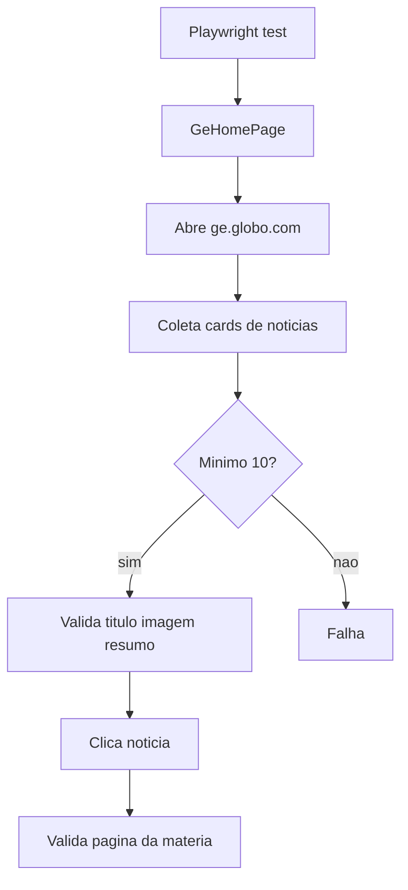
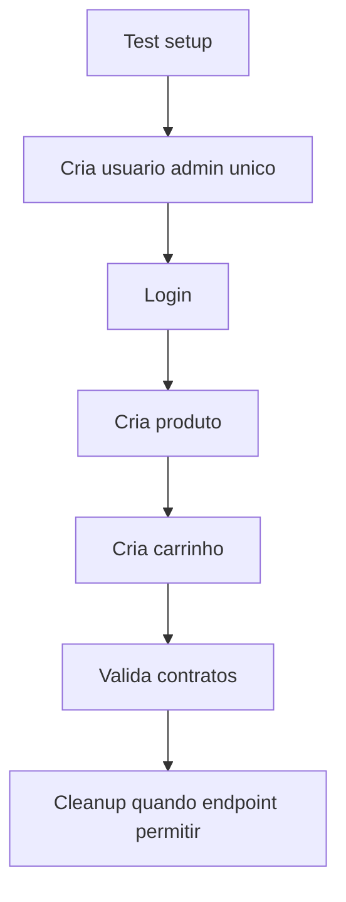

# Fluxogramas

## Criacao de Pedido

Ver [order-flow.mmd](diagrams/order-flow.mmd).

Resumo:

1. Cliente chama mutation GraphQL.
2. Resolver valida DTO.
3. Use case inicia transacao pela porta de Unit of Work.
4. Adapter bloqueia produtos.
5. Dominio valida estoque e total.
6. Pedido e itens sao persistidos.
7. Estoque e debitado.
8. Transacao confirma ou reverte.

## Consulta de Animes

Ver [frontend-flow.mmd](diagrams/frontend-flow.mmd).

Resumo:

1. Usuario informa busca e formato.
2. UI monta variaveis da query.
3. Client AniList chama GraphQL.
4. Resultado e normalizado.
5. Cards exibem score com cor calculada por regra pura.

## RAG Multi-agente

Ver [rag-agent-flow.mmd](diagrams/rag-agent-flow.mmd).

Resumo:

1. Usuario cria thread.
2. Usuario envia mensagem.
3. API carrega historico da thread.
4. Orquestrador decide agents/tools.
5. RAGAgent recupera chunks e secoes.
6. AnalystAgent sintetiza, compara ou ranqueia.
7. Orquestrador consolida resposta.
8. API persiste mensagem do usuario e resposta.

## QA

Fluxo E2E:

Fluxo API ServeRest:

