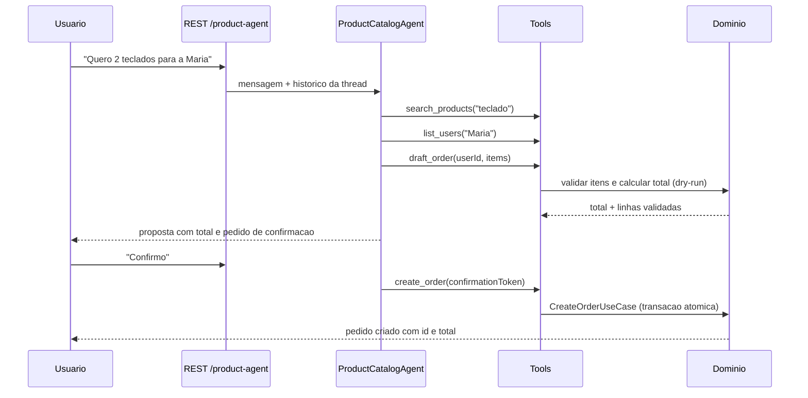

# Plano de IA para o Sistema de Produtos

## Objetivo

Planejar um agente de IA conversacional que interage com o sistema de produtos e pedidos:
consulta catalogo, verifica estoque e preco, monta rascunhos de pedido e cria pedidos com
confirmacao humana explicita. O agente reutiliza a infraestrutura existente em
`packages/ai-agent` e as regras de negocio de `packages/domain`.

## Principios

- O dominio continua dono das invariantes: estoque, total e validacoes passam sempre pelo
  `CreateOrderUseCase`. O LLM nunca calcula preco nem debita estoque.
- Tools sao ports pequenos e independentes (`AgentTool<TInput, TOutput>` ja existente), com
  input validado por `JsonSchema` e retorno `ToolResult` explicito (`ok`/`error`).
- Mutacoes exigem human-in-the-loop: o agente propoe, o usuario confirma, so entao a tool de
  escrita executa.
- Provider de LLM atras de um port (`LlmPort`), permitindo trocar Gemini (default do
  `.env.example`) por Claude ou outro modelo sem tocar em agente ou tools (OCP/DIP).

## Arquitetura

```text
Presentation   REST /product-agent (Swagger) -> threads e mensagens
Application    ProductAgentService -> ProductCatalogAgent (LangChain.js tool calling)
Tools (ports)  search_products | get_product | check_stock | list_users
               draft_order | create_order
Infrastructure ProductReadPort / OrderGatewayPort -> OrdersService (in-memory hoje,
               Postgres amanha) | LlmPort -> Gemini/Claude | LangSmith tracing
Domain         CreateOrderUseCase, erros de dominio, invariantes de estoque
```

### Tools planejadas

| Tool | Tipo | Input | Output | Regra |
|---|---|---|---|---|
| `search_products` | leitura | `{ query, limit? }` | lista de produtos | busca por nome; fase 3 usa embeddings |
| `get_product` | leitura | `{ productId }` | produto | erro `PRODUCT_NOT_FOUND` se ausente |
| `check_stock` | leitura | `{ productId, quantity }` | `{ available, stock }` | nunca reserva estoque |
| `list_users` | leitura | `{ query? }` | lista de usuarios | so id, nome e email |
| `draft_order` | leitura | `{ userId, items[] }` | `{ total, lines[], confirmationToken }` | valida com as regras do dominio sem persistir |
| `create_order` | escrita | `{ confirmationToken }` | pedido criado | so executa com token emitido por `draft_order` e confirmacao explicita do usuario |

O `confirmationToken` e opaco, com TTL curto e escopo de thread: forca a sequencia
`draft -> confirmacao humana -> create` e serve de chave de idempotencia (reenvio do mesmo
token nao duplica pedido).

### Fluxo principal



## Contratos de API

Endpoints REST novos, documentados no Swagger existente:

| Metodo | Rota | Finalidade |
|---|---|---|
| POST | `/product-agent/threads` | Cria thread de conversa do agente de produtos |
| GET | `/product-agent/threads` | Lista threads |
| POST | `/product-agent/threads/{threadId}/messages` | Envia mensagem ao agente |
| GET | `/product-agent/threads/{threadId}/messages` | Historico da thread |

Resposta de mensagem inclui `response`, `toolCalls` (auditoria) e, quando houver proposta,
`pendingConfirmation: { confirmationToken, total, expiresAt }`.

## Guardrails

- Allowlist fixa de tools; nenhuma execucao arbitraria de codigo ou SQL.
- Input de cada tool validado contra `JsonSchema` antes de executar; erro vira `ToolResult`
  de erro, nunca excecao vazando para o usuario.
- Tetos de negocio: quantidade maxima por item, numero maximo de itens e valor maximo por
  pedido configuraveis por env.
- Prompt injection: conteudo de catalogo e tratado como dado (nunca como instrucao) e as
  tools de escrita exigem token que o LLM nao consegue forjar.
- IDs sempre resolvidos por tools de busca; o agente nunca inventa `productId`/`userId`.
- Erros de dominio (`INSUFFICIENT_STOCK`, `PRODUCT_NOT_FOUND`) viram resposta natural com a
  causa e alternativas (ex.: sugerir quantidade menor).

## Observabilidade

- Traces de agente e tools no LangSmith (`LANGSMITH_*` ja previstos no `.env.example`).
- Logs estruturados JSON com `threadId`, tool chamada, duracao e outcome (sem conteudo
  sensivel), reutilizando o `StructuredLogger` da API.
- Metricas Prometheus novas: `ai_tool_calls_total{tool,outcome}` e
  `ai_agent_latency_ms` alem do `api_requests_total` ja emitido pelo interceptor.

## Estrategia de testes (piramide)

- Unit: cada tool com repositorio fake; validacao de schema; maquina de confirmacao
  (`draft -> confirm -> create`) com LLM mockado.
- Integration: agente -> tools -> dominio in-memory; thread store; contrato dos DTOs REST.
- Contract: schemas JSON das tools e OpenAPI dos endpoints novos.
- E2E: um fluxo feliz com LLM gravado (fixture) e um fluxo de estoque insuficiente.
- Avaliacao continua: dataset de perguntas douradas no LangSmith (precisao de tool escolhida,
  taxa de alucinacao de IDs, custo por resposta).

## Fases de entrega

1. **F1 - Catalogo read-only**: `search_products`, `get_product`, `check_stock`,
   agente Q&A sobre catalogo, traces LangSmith, testes unit/integration.
2. **F2 - Pedidos com confirmacao**: `list_users`, `draft_order`, `create_order`,
   `pendingConfirmation` no contrato REST, metricas de tool calls, e2e feliz + estoque
   insuficiente.
3. **F3 - Evolucao**: busca semantica com embeddings no ChromaDB (compose ja provisiona),
   streaming SSE das respostas, avaliacao automatica no CI com dataset dourado.

## Riscos e mitigacoes

| Risco | Mitigacao |
|---|---|
| Alucinacao de IDs ou precos | IDs so via tools; precos sempre do dominio; resposta cita fonte |
| Pedido duplicado | `confirmationToken` idempotente com TTL |
| Prompt injection via nomes de produto | dados escapados no prompt; tools de escrita exigem token |
| Custo de LLM | limite de tokens por thread, cache de respostas de catalogo, modelo menor para F1 |
| Vazamento de dados | logs sem PII; somente id/nome/email nas tools; LangSmith com redaction |
